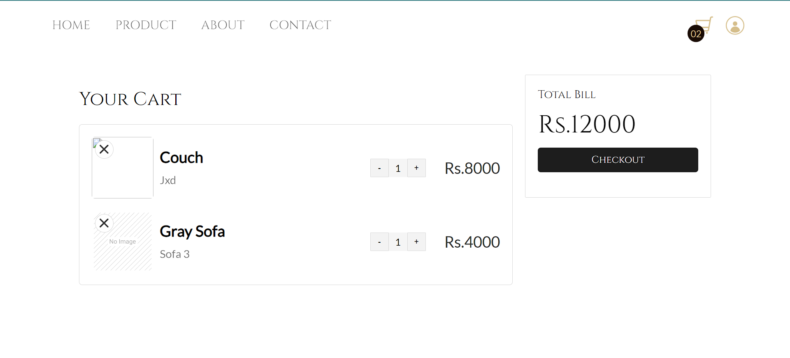

# Virtual-Space-Organizer-Online-Store

## Overview

The Virtual Space Organizer is an innovative online platform designed to revolutionize the way furniture and home accessories are bought and sold. Our website offers a seamless experience for both buyers and sellers, utilizing a combination of HTML, CSS, JavaScript, and server-side scripting with `server.js`. 

We leverage the power of Google Spreadsheets to create a dynamic marketplace where sellers can showcase their products by uploading images and descriptions. Users can effortlessly browse, add items to their cart, and make purchases.

## Key Features

- **Seller Accounts**: Dedicated accounts for sellers to manage their inventory, upload product details, and personalize their storefronts.
- **User Accounts**: Users can create accounts to access a wide array of products, add items to their cart, and enjoy a streamlined shopping experience.
- **Dynamic Marketplace**: Browse and search for furniture and home accessories with ease.
- **Google Spreadsheets Integration**: Efficient data management where uploaded images and product details are stored.

## Technologies Used

- **Frontend**: HTML, CSS, JavaScript
- **Backend**: Server-side scripting with `server.js`
- **Data Management**: Google Spreadsheets

## Screenshots
1. **Home Page**:

2. **Login Page**:

3. **SignUp Page**:

4. **Seller's SignUp Page**:

5. **Product Page**:

6. **Cart Page**:


## How It Works

1. **For Sellers**:
   - Create an account to start managing your inventory.
   - Upload product images and descriptions.
   - Personalize your storefront to enhance visibility.

2. **For Users**:
   - Register to access and browse products.
   - Add items to your cart and make purchases.
   - Enjoy an interactive and user-friendly interface.

## Getting Started

### Prerequisites

- Node.js
- npm (Node Package Manager)

### Installation

1. **Clone the Repository**:
   ```sh
   git clone https://github.com/shreyakushw/Virtual-Space-Organizer-Online-Store.git

2. **Navigate to the Project Repository**:
   ```sh
   cd Virtual-Space-Organizer-Online-Store

3. **Install Dependencies**:
   ```sh
   npm install

4. **Run the Application**:
   ```sh
   node server.js

5. **Access the Website**:
   Open your web browser and navigate to `http://localhost:3000` to start using the platform.

